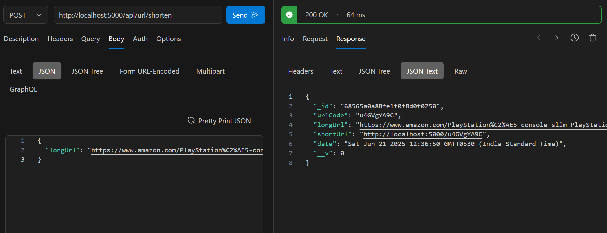
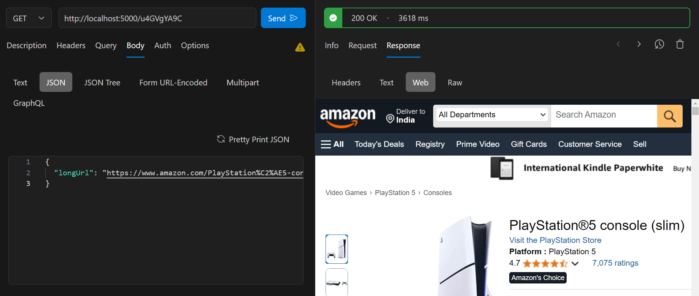

# URL Shortener

A simple URL shortener service built with Node.js, Express, and MongoDB.

## Features

- Shorten long URLs to short, shareable links
- Redirect short URLs to the original long URLs
- Stores URL mappings in MongoDB

## Getting Started

### Prerequisites

- Node.js
- MongoDB

### Installation

1. Clone the repository:
    ```
    git clone <repository-url>
    cd url-shortner
    ```

2. Install dependencies:
    ```
    npm install
    ```

3. Configure your MongoDB connection and base URL in `config/default.json`:
    ```json
    {
      "mongoUrl": "mongodb://localhost:27017/urlshortener", // If this does not works, then create mongodb account and configure the connect and paste the url here.
      "baseUrl": "http://localhost:5000"
    }
    ```

### Running the Application

- Start the server in development mode:
    npm run dev

- Or start normally:
    npm start

The server will run on `http://localhost:5000`.

## API Endpoints

### Shorten URL

- **POST** `/api/url/shorten`
    - **Body:** `{ "longUrl": "https://example.com" }`
    - **Response:** Shortened URL object

### Redirect

- **GET** `/:code`
    - Redirects to the original long URL

## Screenshots





## License

This project is licensed under the ISC License.